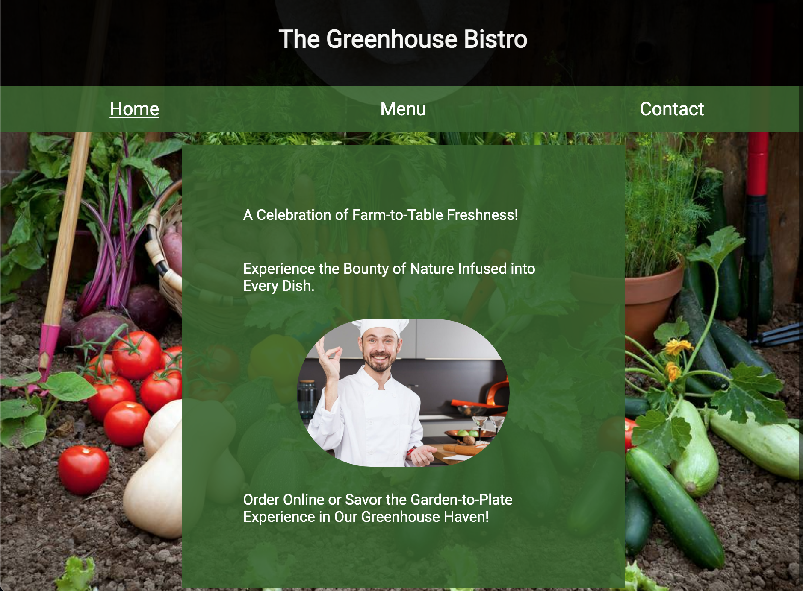

    

<h2 align="center">Greenhouse Bistro page</h2>

  

  Buon appetito!
  

   
  <a href="https://errantpianist.github.io/odin-restaurant-page/">View Demo</a>
  

 

## Preview

 

### Built With

- 
- 
- 
- 

## Features

- A restaurant implemented using pure HTML/CSS/JS
- Dynamic tabbed browsing

 

## Outcome

- Used CSS3 **grid** and **flex** to manage layout
- Used **Javascript** to load entire page through DOM manipulation
- Used **webpack**, **NPM** and **Git** to manage project and dependencies

 

## What I learned

- Use of **webpack** to manage project and dependencies
- Modularising code using **ES6 modules**

 

## Reflections

A site with a bare-bones HTML structure, and the elements all inserted using DOM manipulation.

My first experience using webpack in a JS project - very user friendly after the initial setup.

 

## Acknowledgments

- Thanks to [The Odin Project](https://www.theodinproject.com/) for putting together such an extensive open-source curriculum!
   

<!-- CONTACT -->

## Author

